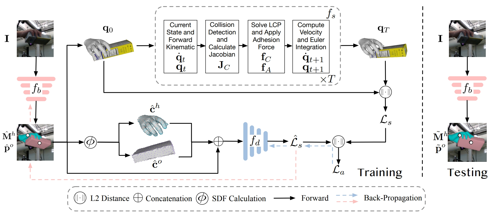

<br />
<p align="center">
    <h1 align="center">
        DeepSimHO: Stable Pose Estimation for Hand-Object Interaction via Physics Simulation
    </h1>

  <p align="center">
    
  </p>
  <p align="center">
    <strong>NeurIPS, 2023</strong>
    <br />
    <a href="https://github.com/rongakowang"><strong>Rong Wang </strong></a>
    .
    <a href="https://github.com/wei-mao-2019"><strong>Wei Mao</strong></a>
    ·
    <a href="http://users.cecs.anu.edu.au/~hongdong/"><strong>Hongdong Li</strong></a>
  </p>
  
  <p align="center">
    <a href='https://openreview.net/pdf?id=SxVHyYavHy'>
      
    </a>
    <a href='https://arxiv.org/abs/2310.07206' style='padding-left: 0.5rem;'>
      
    </a>
    <a href='https://neurips.cc/virtual/2023/poster/71579' style='padding-left: 0.5rem;'>
      
    </a>
  </p>
</p>

<br />

## Installation

### Environment

- Create a conda venv and install `pytorch`:

```
conda env create -f environment.yml
conda activate deepsimHO
pip install torch==1.10.1+cu111 torchvision==0.11.2+cu111 -f https://download.pytorch.org/whl/cu111/torch_stable.html
```

- Install base dependencies:

```
pip install -r requirements.txt
```

- Install additional packages for compatability issues:

```
pip install kaolin==0.13.0 -f https://nvidia-kaolin.s3.us-east-2.amazonaws.com/torch-1.10.1_cu111.html
pip install jaxlib==0.1.65 -f https://storage.googleapis.com/jax-releases/jax_releases.html
```

- Follow the [instructions](https://github.com/lixiny/ArtiBoost/blob/main/docs/Installation.md#Installation) to install dex-ycb-toolkit. Note you should clone it into `main/thirdparty` instead.

- [Optional] If you are running on a headless server, you should create virtual displays for MuJoCo:

```
Xvfb :1 &
export DISPLAY=:1
```

### Data Preperation

- Follow the [docs](https://github.com/lixiny/ArtiBoost/blob/main/docs/Installation.md#Datasets) to prepare datasets for HO3D and DexYCB and download MANO assets, the datasets should be extracted into `main/data` and `main/assets`.
- We provide cached DexYCB and HO3D index for train and test set indicating samples whose ground truth annotations are stable in our settings for MuJoCo, refer to `main/common`.
- We provide MeshLab resampled YCB object [models](https://drive.google.com/drive/folders/1-yfIrPaqLfwJU-kpUfGDsuo9eQwEGp_h?usp=sharing) to train object metrics, download it and extracted to `main/data`. MuJoCo related data can be found in `MuJoCo_data`. 

## Evaluation

### HO3Dv2-

Download the pretrained [model](https://drive.google.com/drive/folders/1-yfIrPaqLfwJU-kpUfGDsuo9eQwEGp_h?usp=sharing) into `main/checkpoints/pretrained` and run the below command.

```sh
cd main
CUDA_VISIBLE_DEVICES=0 python scripts/main.py --cfg config/test/test_ho3dv2-_artiboost_pretrain.yaml --gpu_id 0 --evaluate'
```

### DexYCB

Download the pretrained [model](https://drive.google.com/drive/folders/1-yfIrPaqLfwJU-kpUfGDsuo9eQwEGp_h?usp=sharing) into `main/checkpoints/pretrained` and run the below command.
```sh
cd main
CUDA_VISIBLE_DEVICES=0 python scripts/main.py --cfg config/test/test_dexycb_artiboost_pretrain.yaml --gpu_id 0 --evaluate'
```

If runs properly, you should find the results like below. Note the physics metrics may vary slightly due to the simulation precision.

```
HO3D:
test Epoch 0 | final_loss: 3.3620e-03 | joints_3d_abs_mepe: 97.3570 | corners_3d_abs_mepe: 52.7965 | CP: 0.9659 | PD: 0.0113 | SD: 0.0243 | SR: 0.1917: 100%|███| 48/48
```

```
DexYCB:
test Epoch 0 | final_loss: 1.7286e+00, sym_corners_3d_loss: 1.7285e+01 | joints_3d_abs_mepe: 11.2349 | CP: 0.9590 | PD: 0.0142 | SD: 0.0242 | SR: 0.3283: 100%|███| 50/50
```

## Train

We take training on DexYCB as the example. First train the DeepSim MLP independently:

```sh
python scripts/main.py --cfg config/train/train_dexycb_artiboost_mlp.yaml --gpu_id 0
```

Then jointly train with a base network (We use pretrained Heatmap-based, Object symmetry model in [ArtiBoost](https://github.com/lixiny/ArtiBoost)):

```sh
python scripts/main.py --cfg config/train/train_dexycb_artiboost_pretrain.yaml --gpu_id 0
```

Note that training with MuJoCo is mostly done in CPU, where we use multi-process simulation for speed up.

## Citation

If you use the code for your research, please cite with the below:
```
@inproceedings{
    wang2023deepsimho,
    title={DeepSim{HO}: Stable Pose Estimation for Hand-Object Interaction via Physics Simulation},
    author={Rong Wang and Wei Mao and Hongdong Li},
    booktitle={Thirty-seventh Conference on Neural Information Processing Systems},
    year={2023},
    url={https://openreview.net/forum?id=SxVHyYavHy}
}
```

## Acknowledge

We use [ArtiBoost](https://github.com/lixiny/ArtiBoost) as the code base and thank the authors for releasing the code.
